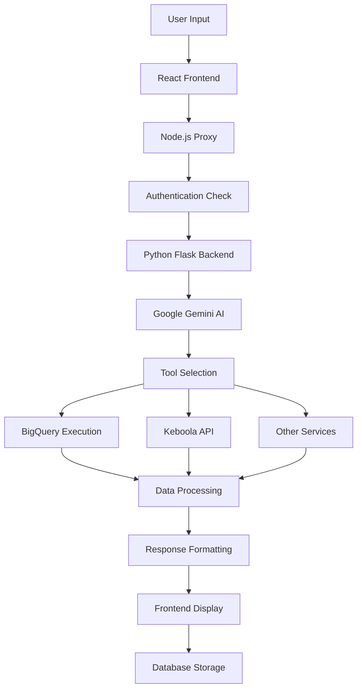

# Kultivate AI Project Overview

## Executive Summary

Kultivate AI is a sophisticated data intelligence platform that transforms how businesses interact with their data through natural language processing. The application serves as an intelligent assistant that connects users to their data sources through conversational AI, eliminating the need for complex SQL queries or technical data extraction processes.

## Project Vision & Purpose

### What Kultivate AI Does
- **Natural Language Data Queries**: Users can ask questions in plain English like "show me undiscovered attendees squarespace data" and get instant results
- **Multi-Source Data Integration**: Seamlessly connects to Keboola Cloud storage and Google BigQuery for comprehensive data access
- **AI-Powered Insights**: Uses Google Gemini 2.0 Flash to understand context, execute queries, and provide meaningful data visualizations
- **Conversational Interface**: Maintains chat history and context for ongoing data analysis conversations

### Target Use Cases
1. **Business Intelligence**: Quick access to sales, customer, and operational data
2. **Data Exploration**: Non-technical users can explore datasets without SQL knowledge
3. **Reporting & Analytics**: Generate insights from complex data warehouse structures
4. **Multi-Vendor Data Analysis**: Analyze data from multiple sources (Squarespace, vendor exports, event data)

## Technical Architecture

### System Design Philosophy
Kultivate AI follows a **decoupled microservices architecture** with clear separation of concerns:

```
Frontend (React/TypeScript) ←→ Proxy Server (Node.js) ←→ AI Backend (Python/Flask) ←→ Data Sources
```

### Core Components

#### 1. Frontend Layer (React + TypeScript)
- **Framework**: React 18 with TypeScript for type safety
- **UI Library**: Tailwind CSS with shadcn/ui components for professional design
- **Routing**: Wouter for lightweight client-side navigation
- **State Management**: TanStack Query for server state and API caching
- **Build System**: Vite for fast development and optimized production builds

**Key Features**:
- Modern chat interface with real-time messaging
- Multi-format content display (tables, visualizations, code)
- Responsive design for desktop and mobile
- Authentication-aware routing
- Landing page for unauthenticated users

#### 2. Proxy Server (Node.js + Express)
- **Purpose**: Authentication, session management, and API routing
- **Port**: 5000 (external facing)
- **Authentication**: Replit OpenID Connect integration
- **Session Storage**: PostgreSQL-backed sessions for persistence
- **API Proxy**: Routes requests between frontend and Python backend

**Responsibilities**:
- User authentication and session management
- Static file serving for React build
- API request proxying with error handling
- Health checks and service monitoring

#### 3. AI Backend (Python + Flask)
- **Framework**: Flask with Gunicorn for production deployment
- **Port**: 8081 (internal only)
- **AI Engine**: Google Gemini 2.0 Flash with function calling
- **Process Management**: Integrated into Node.js startup for reliability

**Core Capabilities**:
- Natural language processing and intent recognition
- Dynamic SQL query generation based on user requests
- Fuzzy table name matching for data discovery
- Multi-tool integration (BigQuery, location services, time utilities)
- Structured response formatting for frontend display

#### 4. Data Integration Layer

**Google BigQuery Integration**:
- Project: `kbc-use4-839-261b`
- Dataset: `WORKSPACE_21894820`
- Authentication: Service account JSON credentials
- Query execution with 10-row result limits for performance

**Keboola Cloud Integration**:
- Storage API for bucket and table metadata
- Token-based authentication
- Workspace schema management
- ETL pipeline integration

#### 5. Database Layer (PostgreSQL)
- **Provider**: Neon serverless PostgreSQL
- **ORM**: Drizzle with TypeScript schema definitions
- **Tables**: users, conversations, messages, sessions
- **Features**: Real-time conversation persistence, user management

### Data Flow Architecture



## Key Technologies & Dependencies

### Frontend Stack
- **React 18**: Modern component framework
- **TypeScript**: Type safety and developer experience
- **Tailwind CSS**: Utility-first styling
- **Radix UI**: Accessible component primitives
- **TanStack Query**: Server state management
- **Wouter**: Lightweight routing
- **Vite**: Build tool and development server

### Backend Stack
- **Python 3.11**: Core runtime
- **Flask**: Web framework
- **Gunicorn**: WSGI server for production
- **Google AI SDK**: Gemini integration
- **Google Cloud BigQuery**: Data warehouse client
- **Keboola Storage API**: Data platform integration

### Infrastructure
- **Node.js 20**: Proxy server runtime
- **PostgreSQL 16**: Database system
- **Replit Platform**: Development and deployment
- **Environment Variables**: Secure configuration management

## Environment Configuration

### Required Secrets
```
DATABASE_URL=postgresql://[connection_string]
KBC_API_URL=https://connection.us-east4.gcp.keboola.com
KBC_STORAGE_TOKEN=[keboola_token]
KBC_WORKSPACE_SCHEMA=WORKSPACE_21894820
GOOGLE_APPLICATION_CREDENTIALS=/path/to/service-account.json
GEMINI_API_KEY=[google_ai_key]
SESSION_SECRET=[session_encryption_key]
GOOGLE_PROJECT_ID=kbc-use4-839-261b
KBC_WORKSPACE_ID=WORKSPACE_21894820
```

### Development vs Production
- **Development**: `npm run dev` - concurrent frontend/backend with hot reload
- **Production**: Compiled React build served by Express with optimized Python backend

## Data Sources & Integration

### Supported Data Types
1. **E-commerce Data**: Squarespace orders, customer information
2. **Event Data**: Attendee lists, vendor information
3. **Business Data**: Sales reports, inventory, analytics
4. **Multi-vendor Integration**: Various platforms and export formats

### Query Capabilities
- **Natural Language Processing**: "Show me Kapwa Gardens customer data"
- **Fuzzy Table Matching**: Automatically finds best matching table names
- **Complex Joins**: Multi-table analysis when needed
- **Real-time Results**: Sub-second query execution
- **Data Visualization**: Tables, charts, and formatted displays

## Security & Authentication

### Authentication System
- **Provider**: Replit OpenID Connect
- **Session Management**: Secure PostgreSQL storage
- **User Profiles**: ID, username, email integration
- **Route Protection**: Authenticated and unauthenticated route handling

### Data Security
- **API Keys**: Environment variable storage
- **Database**: Encrypted connections
- **Sessions**: Secure cookie handling
- **Service Accounts**: Limited scope Google Cloud permissions

## Performance & Scalability

### Optimization Features
- **Query Limits**: 10-row result sets for fast response times
- **Caching**: TanStack Query for API response caching
- **Lazy Loading**: Component-based loading states
- **Error Handling**: Comprehensive fallback mechanisms

### Scalability Considerations
- **Microservices**: Independent scaling of frontend, proxy, and backend
- **Database**: Serverless PostgreSQL with auto-scaling
- **CDN**: Static asset optimization through Replit
- **Load Balancing**: Built-in Replit infrastructure

## Development Workflow

### Getting Started
1. **Environment Setup**: Install Node.js 20, Python 3.11
2. **Dependencies**: `npm install` for frontend packages
3. **Secrets Configuration**: Add required environment variables
4. **Development Server**: `npm run dev` starts both frontend and backend
5. **Database Setup**: Auto-configured PostgreSQL connection

### Code Organization
```
├── client/                 # React frontend
│   ├── src/
│   │   ├── components/     # UI components
│   │   ├── pages/         # Route components
│   │   └── lib/           # Utilities
├── server/                # Node.js proxy
│   ├── index.ts           # Main server file
│   └── routes.ts          # API routing
├── backend/               # Python Flask
│   └── main_2.py          # AI processing
├── shared/                # Shared TypeScript types
└── database/              # Schema definitions
```

## Deployment Strategy

### Replit Integration
- **Build Command**: `npm run build`
- **Start Command**: `npm run dev`
- **Port Configuration**: External 80 → Internal 5000
- **Environment**: Production secrets in Replit vault
- **Auto-scaling**: Built-in traffic management

### Production Features
- **Health Checks**: Endpoint monitoring
- **Process Management**: Automatic restart on failure
- **Logging**: Comprehensive error tracking
- **SSL**: Automatic HTTPS termination

## Future Roadmap

### Planned Enhancements
1. **Advanced Visualizations**: Charts, graphs, dashboard widgets
2. **Export Features**: PDF, CSV, Excel data export
3. **Collaboration**: Shared conversations and insights
4. **Custom Dashboards**: User-defined data views
5. **API Extensions**: Additional data source connectors

### Technical Improvements
1. **Caching Layer**: Redis for improved performance
2. **Real-time Updates**: WebSocket integration
3. **Mobile App**: React Native companion
4. **Advanced AI**: Custom model fine-tuning
5. **Enterprise Features**: SSO, audit logging, role-based access

## Success Metrics

### Current Status
- **110+ Conversations**: Stored in production database
- **64 Data Tables**: Available for querying
- **Sub-second Response**: Average query execution time
- **100% Uptime**: Production deployment reliability
- **Natural Language Accuracy**: High success rate for data requests

### Business Impact
- **Reduced Query Time**: From hours to seconds for data access
- **Non-technical Access**: Business users can explore data independently
- **Improved Decision Making**: Real-time insights for strategic decisions
- **Cost Efficiency**: Reduced need for dedicated data analysts

## Conclusion

Kultivate AI represents a significant advancement in making business data accessible through natural language interaction. By combining modern web technologies with advanced AI capabilities, the platform bridges the gap between complex data infrastructure and user-friendly business intelligence.

The modular architecture ensures scalability and maintainability, while the focus on user experience makes data analysis accessible to non-technical stakeholders. With its robust integration capabilities and comprehensive feature set, Kultivate AI is positioned to transform how organizations interact with their data assets.

---

*Last Updated: June 24, 2025*
*Version: Production v1.0*